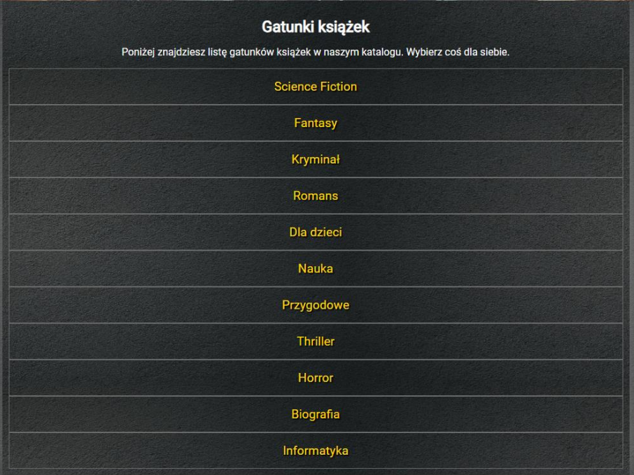

<div align="center">


<h1>LibraryOnline</h1>


|       ENDPOINT        | METHOD  |         REQUEST          |       RESPONSE       |                    FUNCTION                     |
|:---------------------:|:-------:|:------------------------:|:--------------------:|:-----------------------------------------------:|
|       api/auth        |  POST   |  JSON BODY (credentials) |    JSON (JWT token)  | returns token after successfully authorization  |
|       api/books       |  GET    |            -             |      JSON (books)    |                returns all books                |
|       api/books       |  POST   |    JSON BODY (book)      |      JSON (uuid)     |                creates new book                 |
|   api/books/{uuid}    |  GET    |   PATH VARIABLE (uuid)   |      JSON (book)     |            returns book with given uuid         |
|   api/recommended     |  GET    |            -             |      JSON (books)    |            returns all recommended books        |
|       api/genres      |  GET    |            -             |      JSON (genres)   |                returns all genres               |
|       api/genres      |  POST   |    JSON BODY (genre)     |      JSON (uuid)     |                returns new genres               |
|   api/genres{name}    |  GET    |   PATH VARIABLE (name)   |      JSON (genre)    |            returns genre with given name        |


## Tech Stack
Code: <br>


<br>
FrontEnd: <br>


<br>
Other: <br>


  ## How to build the project on your own
#### To build the project:
<ol>
<li>Clone the repository:</li>

```
git clone https://github.com/hadala-p/RATEmyREAD.git
```
<li>Go to the folder with cloned repository</li> 
<li>Run the command on all services:</li>

```
mvn package 
```
<li>In folder target you should find a file named: application-{version}-SNAPSHOT.jar</li>
</ol>

#### To build the docker image with Docker Compose:
<ol>
<li>Clone the repository:</li>

```
git clone https://github.com/hadala-p/RATEmyREAD.git
```
<li>Go to the folder with cloned repository</li> 
<li>Run the command:</li>

```
docker-compose build
```
<li>By using:

```
docker images
```
</li>
</ol>

  <h4>Test accounts</h4>


  |ROLE     | EMAIL             | PASSWORD                 |
  |:-------:|:-----------------:|:------------------------:|
  |ADMIN    |admin@library.com  |       adminpass          |
  |EDITOR   | editor@library.com|       editorpass         |
  |USER     | user@library.com  |       userpass           |


# Frontend
## Logo

## Recommended

## Top 10

## Book Details

## Rating System

## Genres

## Admin Panel

## Book Adding Form 

## Genre Adding Form 

## Login Form

## Error 404

</div>
